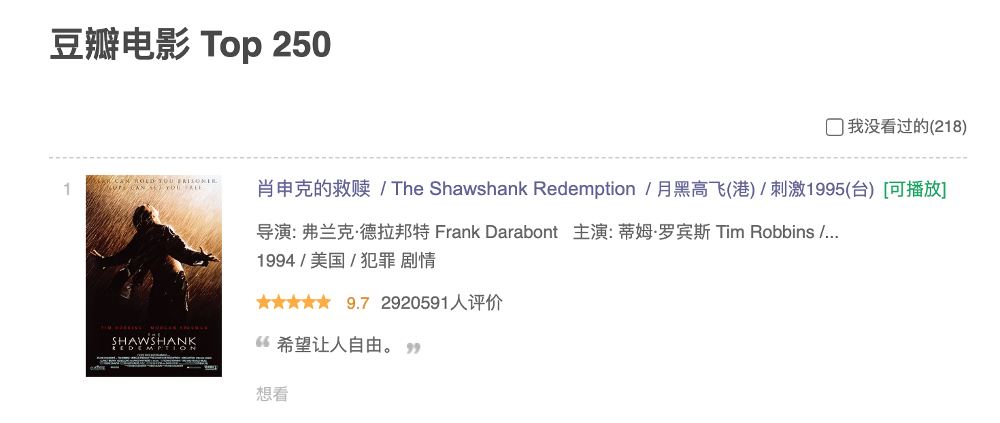
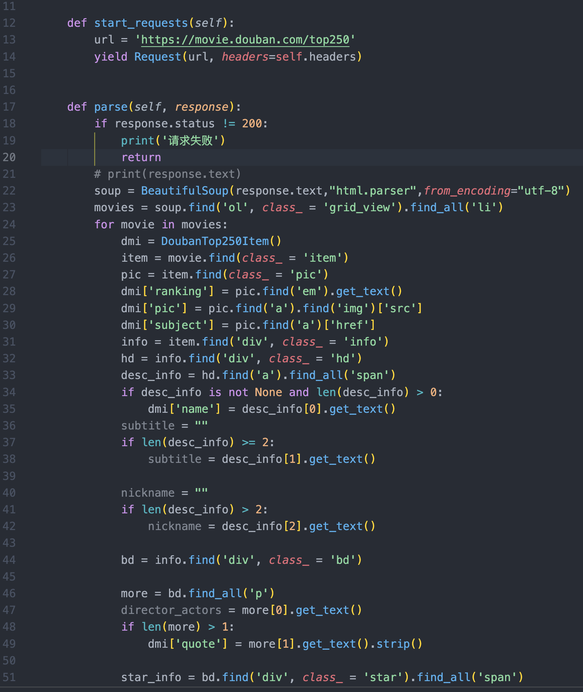
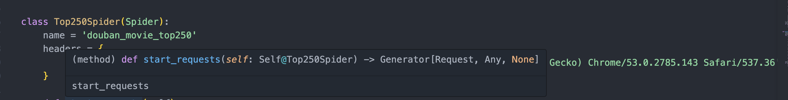

# 高阶爬虫学习

* 使用Selenium/Scrapy进行自动化爬虫
* 爬虫性能优化和并发处理

## 教学指导书大纲

**课程标题：Python爬虫高阶技巧：Selenium与Scrapy**

**目标：** 通过实际任务，学生将学会使用Selenium和Scrapy来爬取动态网站和结构化数据。

**前提知识：** 学生应具备Python基础知识和了解基本的Web爬虫概念。

**课程内容：**

1. **介绍与背景**

   - 爬虫高阶技巧的重要性
   - 本课程的目标和内容概述
2. **Selenium的使用**

   - 什么是Selenium？
   - 安装与配置Selenium
   - 打开和操作浏览器
   - 等待页面加载
   - 执行JavaScript
   - 模拟用户交互
   - 示例：使用Selenium爬取动态网页数据
3. **Scrapy的使用**

   - 什么是Scrapy？
   - 安装与创建Scrapy项目
   - 创建Spider和Item
   - 配置和定制Pipeline
   - 使用选择器提取数据
   - 处理分页和链接跟踪
   - 示例：创建一个Scrapy爬虫项目
4. **实际任务：爬取豆瓣电影top250**

   - 使用Selenium和Scrapy来爬取并结构化所选网站的数据
   - 数据存储和分析
5. **学习总结与讨论**

   - 学生展示爬取任务的结果
   - 讨论爬虫挑战和解决方案
   - 总结Selenium和Scrapy的关键概念
   - 下一步学习建议

## 使用scrapy爬取豆瓣电影Top250

<!-- https://www.bilibili.com/read/cv22397536/ -->

目标爬取网站：https://movie.douban.com/top250

### 安装爬虫工具

- 你可以使用Scrapy来构建爬虫，它是一个强大的爬虫框架，适用于处理大规模的爬取任务。确保你已经安装了Scrapy（可以使用 `pip install scrapy`安装）。

在命令行执行 `scrapy`，会看到有各种命令可以使用

```shell
Scrapy 2.10.1 - active project: douban_top250

Usage:
  scrapy <command> [options] [args]

Available commands:
  bench         Run quick benchmark test
  check         Check spider contracts
  crawl         Run a spider
  edit          Edit spider
  fetch         Fetch a URL using the Scrapy downloader
  genspider     Generate new spider using pre-defined templates
  list          List available spiders
  parse         Parse URL (using its spider) and print the results
  runspider     Run a self-contained spider (without creating a project)
  settings      Get settings values
  shell         Interactive scraping console
  startproject  Create new project
  version       Print Scrapy version
  view          Open URL in browser, as seen by Scrapy

Use "scrapy <command> -h" to see more info about a command
```

### 创建Scrapy项目

- 在终端中使用以下命令创建一个新的Scrapy项目：

  ```shell
  scrapy startproject douban_top250
  ```

  这将创建一个名为 `douban_top250` 的项目目录。
- 进入项目根目录：`cd douban_top250/`

### 创建Spider

- 在Scrapy项目中，Spider是用于定义如何爬取和解析网页的类。创建一个新的Spider，以定义如何爬取豆瓣电影Top 250页面。
- 在项目的根目录下，进入 `douban_top250/spiders` 目录，创建一个名为 `top250_spider.py` 的Spider文件。
- 编辑 `top250_spider.py` 文件，定义Spider的名称、起始URL和如何解析页面。以下是一个示例：

  ```python
  import scrapy

  class Top250Spider(scrapy.Spider):
      name = 'top250'
      start_urls = ['https://movie.douban.com/top250']

      def parse(self, response):
          # 在这里编写解析网页的代码
          pass
  ```

### 定义爬取数据结构Item

- 打开[`items.py`](./douban_top250/douban_top250/items.py)文件，定义 `DoubanTop250Item`这个类，注意这个类是用来存储我们要爬取的数据item的。
- 从网页上看，页面里的电影top250榜单是一个列表。而我们的目标是爬取列表里每个电影的信息。
- 从网页上看，每个电影包含了以下信息
  
- 为简单起见，我们限定爬的电影数据包括排名、评分、打分星数、电影名称、评分人数等。
- 因此 `DoubanTop250Item`类可以按下面方式来写。

```python

import scrapy


class DoubanTop250Item(scrapy.Item):
    # define the fields for your item here like:
    ranking = scrapy.Field() #电影排名
    pic = scrapy.Field() #电影封面图
    name = scrapy.Field() #电影名称
    star = scrapy.Field() #电影评分星星数
    score = scrapy.Field() #电影评分0 - 10
    score_num = scrapy.Field() #电影评价人数
    quote = scrapy.Field() #电影引言
    subject = scrapy.Field() #电影的详细内容链接
    pass
```

### 解析网页内容

- 定义完 `DoubanTop250Item`，我们需要构造这个类的数据源。首先确定我们在 `top250_spider.py`文件导入刚刚定义的类：`from douban_top250.items import DoubanTop250Item`
- 在 刚创建的 `top250_spider.py`文件的 `parse` 方法中，你需要编写代码来解析豆瓣电影Top 250页面的内容。你可以使用Scrapy的选择器来提取电影信息，如电影名称、评分、导演等。
- 通过前两节课学习的方法，查看页面的HTML结构和元素，使用BeautifulSoup或XPath或CSS选择器来选择和提取所需的数据。

#### BeautifulSoup解析网页

BeautifulSoup解析网页的指导参考：[](../07_爬虫基础/learn_beautifulSoup.md)

本课案例的网页解析详见 [top250_spider.py/parse](./douban_top250/douban_top250/spiders/top250_spider.py)



此时，我们可以在项目根目录(第一个douban_top250目录)执行

`scrapy runspider douban_top250/spiders/top250_spider.py -o douban.csv`

其中 `-o douban.csv`是将结果保存在本地csv文件中，保存列的顺序是按照中item类定义的各列的顺序。

运行后可能会报错，检查下header是否设置。



#### XPath解析网页

参考:[](./learn_xpath.md)

#### CSS解析网页


### 存储数据

- 在Spider中，你可以将爬取的数据存储到文件、数据库或其他目标位置。根据需要，可以使用Scrapy提供的Item Pipeline来进行数据处理和存储。

今天我们只学习把文件存储文件中。等下一节课学习把文件存储到数据库中。

### 运行爬虫

- 在项目的根目录下，在终端中运行以下命令来启动爬虫：

  ```
  scrapy crawl top250
  ```

  这将开始爬取豆瓣电影Top 250页面并执行你编写的Spider。

### 数据处理和分析

- 一旦爬虫运行完成，你可以处理和分析爬取的数据，例如生成报告、绘制图表或进行其他操作。

请注意，豆瓣网站可能有反爬虫机制，你需要谨慎爬取，并确保遵守网站的使用政策。另外，为了保护你的爬虫不受封禁或限制，可以设置合适的爬取速度和等待时间。

这是一个简单的起点，你可以根据需要进一步优化和扩展爬虫，以获取更多关于豆瓣电影Top 250的信息。 Scrapy 提供了丰富的功能，以便更灵活地处理和爬取网页内容。希望这个指南能帮助你开始构建你的爬虫项目。

## 更多内容请查看

[自动获取cookie](./get_cookie_automated.md)
